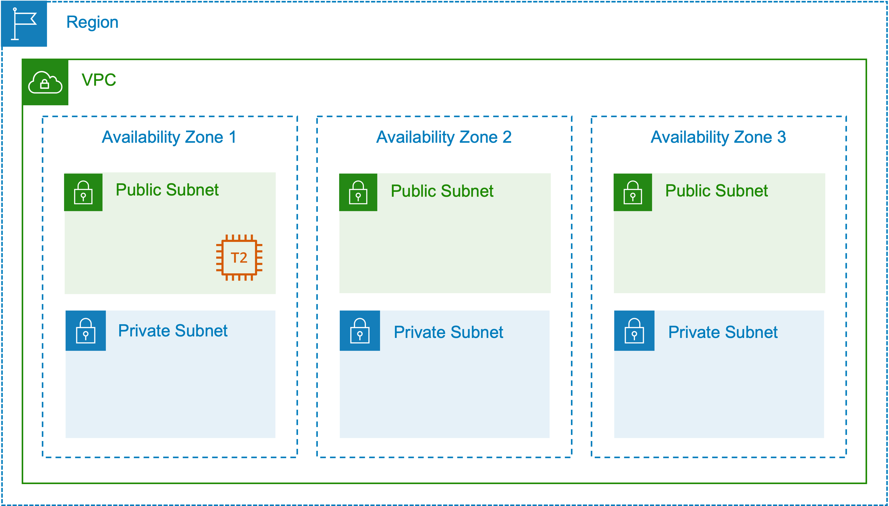

# Exploring Terraform States

In this lab 2 we will explore the apply we done in lab1 and we will check the states file. Now let's see what is a statefile and why it is important

## What is [Terraform state](https://developer.hashicorp.com/terraform/language/state)

--> In order to properly and correctly manage your infrastructure resources, terraform stores the state of your managed  infrastructure. This state must be stored and maintained on each execution so future operations can perform correctly.

--> By default it is stored in the *"terraform.tfstate"* file. By this when approved to proceed, only the necessary changes will be applied, leaving existing valid infrastructure untouched. But we will explore the terraform cloud *[terrraform remote state](https://developer.hashicorp.com/terraform/language/state/remote)* to store this statefile so it can be accessed by all team members working in the same project.

## Benefits of the Terraform state

--> During an execution, Terraform willexamine the state of currently running infrastructure, determines the differences exist between current and revised desired state.

--> By this when approved to proceed, only changes will be applied , leaving existing valid infrastructure untouched.

**LAB TASK**

1. Show current state
2. Update the configuration
3. Plan and execute the changes
4. Show new state



1. To show the current state, follow the command.

*remember the **terraform.tfstate** shouldn't be empty. means you must have done terraform apply command*

```sh {"id":"01J28F6EPSSR9TMQ9N9XWAYTQZ"}
terraform show
```

```sh {"id":"01J28JYFZRRAQHX65GABV8MHSJ"}
# 1.1 add this state to the oldstate.json
terraform show > oldstate.json
```

2. Update your configuration

The below snippet is added to the [main.tf](./main.tf)

```sh {"id":"01J28JKPSDG2RTF3JHDNCRKVMD"}
# Lab2 work is here. Here we will create an ec2 instancce into our environment
# Terraform Data Block - To Lookup Latest Ubuntu 20.04 AMI Image
data "aws_ami" "ubuntu" {
  most_recent = true

  filter {
    name   = "name"
    values = ["ubuntu/images/hvm-ssd/ubuntu-focal-20.04-amd64-server-*"]
  }

  filter {
    name   = "virtualization-type"
    values = ["hvm"]
  }

  owners = ["099720109477"]
}

# Terraform Resource Block - To Build EC2 instance in Public Subnet
resource "aws_instance" "web_server" {
  ami           = data.aws_ami.ubuntu.id
  instance_type = "t2.micro"
  subnet_id     = aws_subnet.public_subnets["public_subnet_1"].id
  tags = {
    Name = "Ubuntu EC2 Server"
  }
}
```

3. Plan and Execute the changes

```sh {"id":"01J28K00RJ73YMB625VZX341KZ"}
terraform plan
```

```sh {"id":"01J28K0DVEQTJFZBX8HC4FMRTZ"}
terraform apply -auto-approve
```

4. Show the new state

```sh {"id":"01J28JQWN85MCMFS85J6HGGTQZ"}
terraform show
```

```sh {"id":"01J28JWPQFKGAW30MCDNM6M573"}
# 4.1 add the state to newstate.json
terraform show > newstate.json
```

Alternatively you can run a terraform state list to list all of the items in Terraform's managed state.

```sh {"id":"01J28KDHVA2374E0B4K3SZ4YHG"}
terraform state list
```